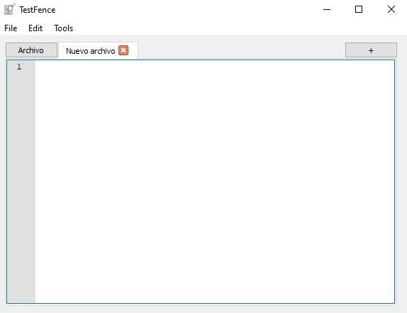
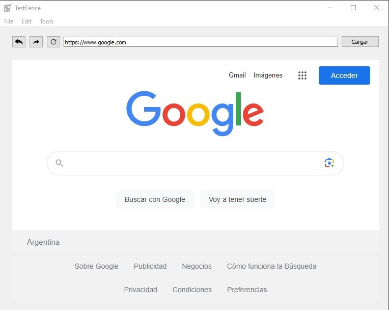
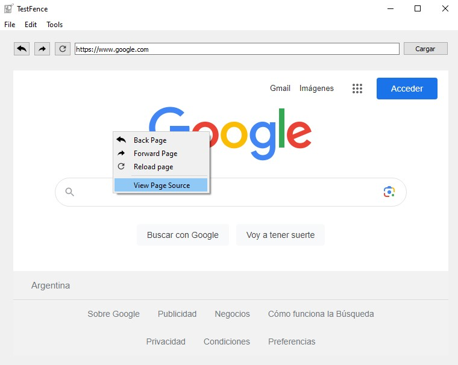
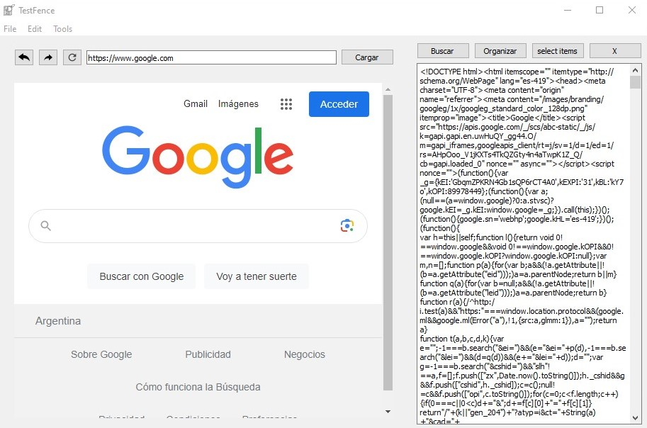
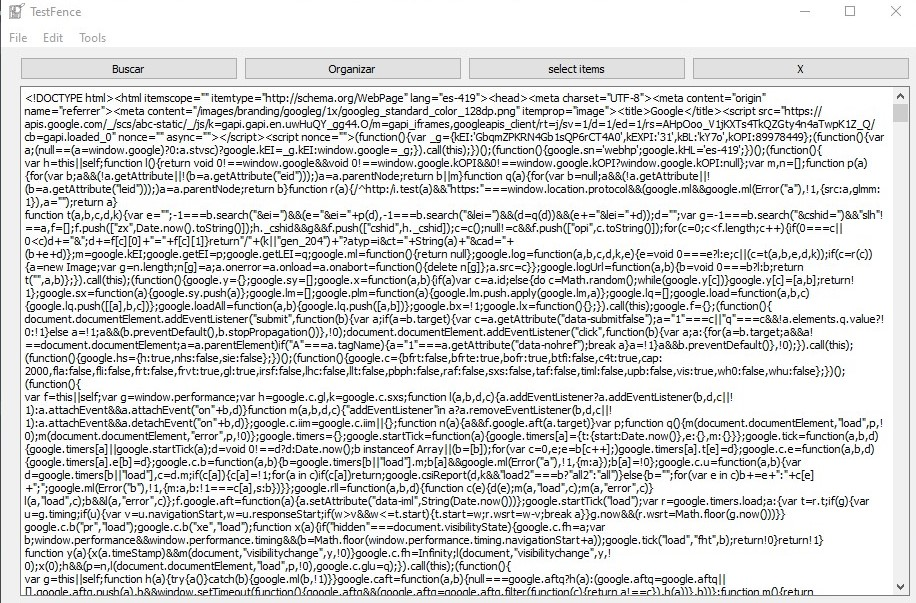
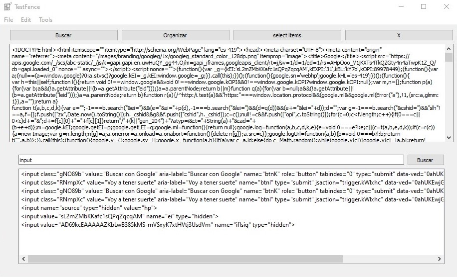
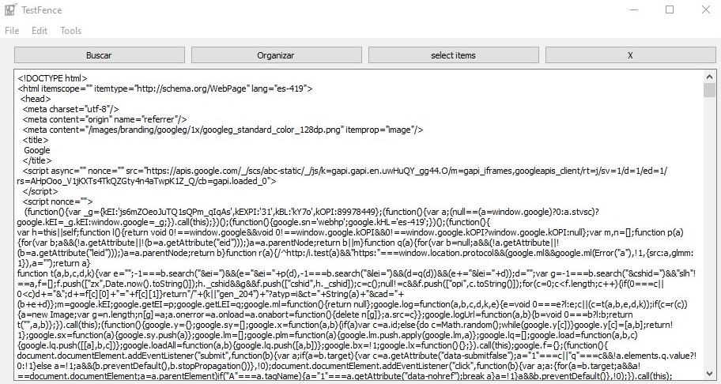
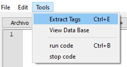
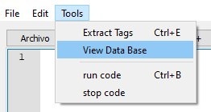

# TestFence Documentation


This is the documentation for the TestFence app, which is designed for testing web applications. Currently, it focuses on functionality testing, but future versions will include security testing capabilities.


## Using the Code Editor Section

In this section, you can enter the code to be executed later.




### Allowed Functions for Function


```python
# Set a new URL
set_url('URL', time_wait=True)

# Configure content
set_content('TAG', 'Attribute', 'contentAttribute', 'text', tag_navigation=True)

# Click on an element
click_element('TAG', 'Attribute', 'contentAttribute', time_wait=True, tag_navigation=True)

# Wait for the page to fully load
wait_page()
```

* The "time_wait=True" parameter in "click_element()" and "set_url()" functions is used to wait for the page to finish loading before performing the action. It functions similarly to the "wait_page()" function.
* The "tag_navigation=True" parameter indicates that the element will be searched first, centered on the screen, highlighted, and then the specified action will be performed. This parameter is only used in the "set_content()" and "click_element()" functions.


## Using the Web Browser


Below is an image of the browser in action.




In this section, you will find basic functionalities of any modern web browser.

* To access the HTML source code of the site, right-click on the browser container:





A section will appear showing the HTML of the site:




## Using the HTML View

In this section, you can search for specific HTML tags to perform certain actions on them.





In the navigation part of this section, you will find four options:


### Search 

This option allows you to search for specific tags in the HTML, either a single tag or multiple tags.



The search syntax is as follows:

* For multiple tags: `input`
* For a tag with an attribute: `input; class`
* For a tag with an attribute and specific content: `input; class:gNO89b`


### Organize 

This function organizes the HTML code.




### Select Item

This function is used when selecting an item, and it will be explained in the navbar section.


### X Button

This button is used to close the HTML section.


## Navbar


### File

#### New File : CRTL + N
#### Open file : CRTL + O
#### Save : CRTL + S 
#### Save AS : CRTL + Shift + S
#### Close file : CRTL + W
#### Close all File 
#### Exist


### Edit 

#### Undo : CRTL + Z
#### Rendo : CRTL + Y
#### Cut : CRTL + C 
#### Copy : CRTL + X
#### Paste : CRTL + V


### Tools

#### Extract Tag

This option is used to select an element from the browser and extract the corresponding tag, which will be displayed in the HTML section under "select item."





#### View Database Errors

In this part, the database errors related to functionality will be displayed.





#### Run code: CRTL + B


#### Stop Code (currently not functional)