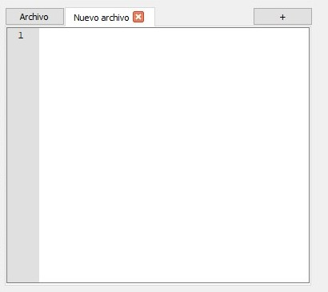

# TestFence

TestFence es una aplicación de testing de sitio web diseñada para evaluar la seguridad y la calidad del código de una aplicación web. Proporciona una plataforma versátil y fácil de usar que permite realizar pruebas exhaustivas y automatizadas.


## Características principales

- Evaluación exhaustiva de las funcionalidades del sitio web para garantizar su correcto funcionamiento.
- Generación de informes detallados con resultados de las pruebas y recomendaciones.(Actualmente mejorando esta funcionalidad)


## Feature

- Evaluación de la calidad del código y detección de errores comunes en las funcionalidades del sitio.
- Pruebas automatizadas para identificar posibles brechas y vulnerabilidades en las funcionalidades del sitio.


## Instalación y Uso

### Instalación

```
git clone https://github.com/tuusuario/testfence.git
cd TestFence
pip install -r requirements.txt
python main.py
```


### Uso 

1. Estas son algunas funciones para el testeo:


```python
# Establecer una nueva URL
set_url('URL', time_wait=True)

# Configuración de contenido
set_content('TAG', 'Atribute', 'contentAtribute', 'text', tag_navigation=True)

# Realizar clic en el elemento
click_element('TAG', 'Atribute', 'contentAtribute', time_wait=True, tag_navigation=True)

# Esperar a que la página cargue completamente
wait_page()
```

* El parámetro "time_wait=True" en "click_element()" y "set_url()" es para esperar a que la página termine de cargar antes de realizar la acción, es similar a la función "wait_page()".
* El parámetro "tag_navigation=True" indica que primero se buscará el elemento, se centrará en la pantalla, se resaltará y luego se realizará la acción especificada. Solo en las funciones de "set_content()" y "click_element()".


### Ejemplo de Uso

1. Agrega este código en esta sección:




```python
# Configuración de URL
set_url('https://www.google.com', time_wait=True)

# Configuración de contenido
set_content('textarea', 'class', 'gLFyf', 'que pasa si no dormimos')

# Realizar clic en el elemento
click_element('input', 'class', 'gNO89b', time_wait=True)

# Realizar clic en un enlace con navegación hacia el elemento
click_element('a', 'href', 'https://businessinsider.mx/efectos-insomnio-que-pasa-si-dejas-de-dormir/', tag_navigation=True)

# Esperar a que la página cargue completamente
wait_page()

# Establecer una nueva URL
set_url('https://www.google.com')

# Esperar a que la página cargue completamente
wait_page()
```

2. Una vez agregado dicho código en la misma sección ejecútalo con "CTRL + B".


## Contribución

¡Estamos abiertos a colaboraciones! Si deseas contribuir a TestFence, por favor sigue los siguientes pasos:

1. Crea un fork del repositorio.

2. Crea una nueva rama para tu contribución:

```
git checkout -b feature/nueva-funcionalidad
```

3. Realiza tus cambios y realiza los commits correspondientes.

4. Envía un pull request con tus cambios.

5. Nosotros revisaremos tu pull request y te proporcionaremos comentarios.


## Licencia

TestFence se distribuye bajo la licencia Apache-2.0. Para más detalles, consulta el archivo [LICENSE](LICENSE).
